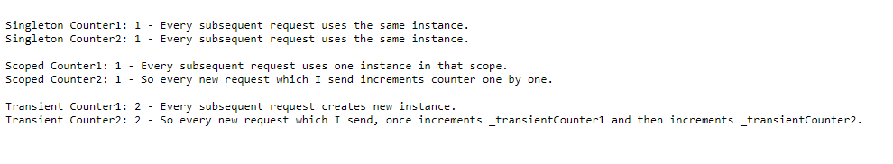
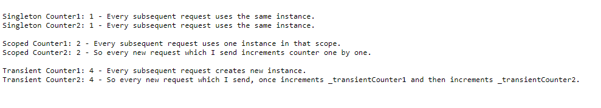

## Lucky Counter for Better Understanding Dependency Injection Lifetimes

- Scoped, Singleton and Transient Lifetime explained with simple Counter.

- Our Counter is a static int which initialize as 0.

### Singleton Lifetime

- Our Counter first initialized and increment one. This Counter state does not change every other requests.

### Scoped Lifetime

- Our Counter first initialized and increment one. This Counter state changes every other requests in that scope.

### Transient Lifetime

- Our Counter first initialized and increment one. This Counter state changes every other requests and every other call instances.

#### First Request

#### Second Request

